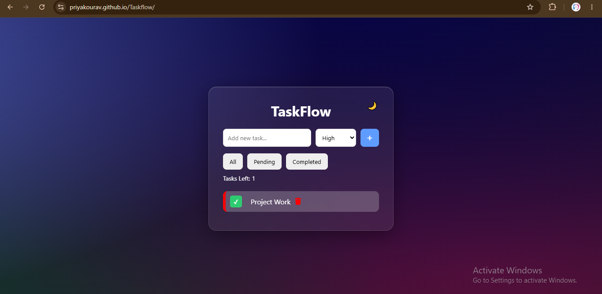
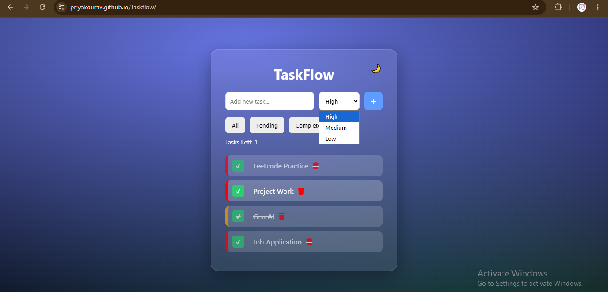
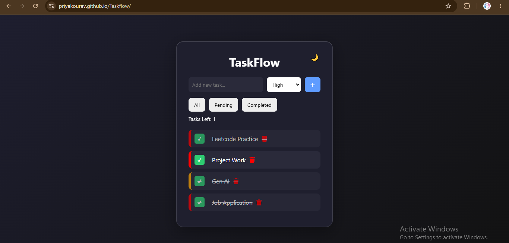

# Smart To-Do List 

A modern and interactive **To-Do List Web App** built using **HTML, CSS, and JavaScript**.
This project helps users manage daily tasks with a clean UI, priority levels, filters, and local storage support.

The goal of this project was to practice **JavaScript DOM manipulation, local storage, and UI design** while building a practical productivity tool.

## Live Features

* Add new tasks
* Mark tasks as completed
* Delete tasks
* Set task priority (High / Medium / Low)
* Filter tasks (All / Pending / Completed)
* Drag and drop tasks to reorder them
* Dark mode toggle
* Task counter
* Smooth animations and hover effects
* Tasks saved using **Local Storage** (data remains after refresh)

## Tech Stack

 **HTML5** – Structure of the application
 **CSS3** – Styling, animations, and responsive layout
 **JavaScript (Vanilla JS)** – Logic, DOM manipulation, and local storage

No frameworks or libraries were used.

## UI Highlights

* Glassmorphism style To-Do container
* Animated 3D gradient background
* Smooth hover and task animations
* Clean modern layout

## Project Structure

todo-project
│
├── index.html
├── style.css
├── script.js
└── README.md

## Learning Outcomes

While building this project, I practiced:

* JavaScript DOM manipulation
* Event handling
* Working with Local Storage
* UI animations using CSS
* Organizing frontend project structure
* Creating interactive web applications without frameworks

## Future Improvements

* Add task editing feature
* Add due dates for tasks
* Add search functionality
* Add mobile optimization

## Preview

## Live Demo Link 

https://priyakourav.github.io/Smart-To-Do-List/

